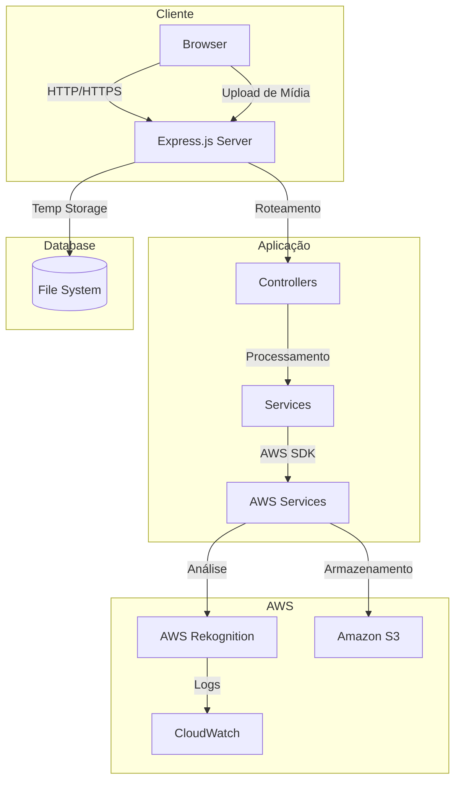

# Arquitetura do AWS Rekognition Node.js

## Visão Geral

Este documento descreve a arquitetura detalhada do projeto AWS Rekognition Node.js, incluindo seus componentes, fluxos de dados e integrações.

## Diagrama de Arquitetura Detalhado



## Componentes Principais

### 1. Frontend
- Interface web responsiva usando Bootstrap
- Templates EJS para renderização server-side
- Formulários para upload de mídia
- Visualização de resultados em tempo real

### 2. Backend (Express.js)
- Servidor Node.js com TypeScript
- Middleware de autenticação e validação
- Gerenciamento de uploads com Multer
- Roteamento e controllers organizados

### 3. Serviços AWS
#### Amazon Rekognition
- Análise facial
- Detecção de objetos
- Reconhecimento de texto
- Análise de vídeo

#### Amazon S3
- Armazenamento de mídia
- Gerenciamento de lifecycle
- Backup e redundância

#### CloudWatch
- Monitoramento de performance
- Logs de aplicação
- Métricas customizadas

## Fluxos de Dados

### 1. Upload de Imagem
```sequence
Browser->Express: Upload imagem
Express->Multer: Processa upload
Multer->S3: Armazena imagem
S3->Rekognition: Envia para análise
Rekognition->Express: Retorna resultados
Express->Browser: Exibe análise
```

### 2. Análise de Vídeo
```sequence
Browser->Express: Upload vídeo
Express->S3: Armazena vídeo
S3->Rekognition: Inicia análise assíncrona
Rekognition->SNS: Notifica conclusão
SNS->Express: Webhook de conclusão
Express->Browser: Atualiza resultados
```

## Considerações de Segurança

### Autenticação e Autorização
- AWS IAM para gerenciamento de acessos
- Políticas de menor privilégio
- Rotação regular de credenciais

### Proteção de Dados
- Criptografia em trânsito (HTTPS)
- Criptografia em repouso (S3)
- Validação de entrada
- Sanitização de saída

### Rede
- VPC para isolamento
- Security Groups
- Network ACLs

## Escalabilidade

### Horizontal
- Load balancing
- Auto-scaling groups
- Distribuição geográfica

### Vertical
- Otimização de recursos
- Caching
- Compressão

## Monitoramento e Logging

### Métricas
- Latência de requisições
- Taxa de erros
- Uso de recursos
- Custos

### Logs
- Logs de aplicação
- Logs de acesso
- Logs de auditoria
- Logs de performance

## Custos e Otimização

### Componentes de Custo
1. AWS Rekognition
   - Por imagem analisada
   - Por minuto de vídeo
   - Por face armazenada

2. Amazon S3
   - Armazenamento
   - Transferência
   - Requisições

3. Outros
   - Computação
   - Rede
   - Monitoramento

### Estratégias de Otimização
- Cache de resultados
- Compressão de mídia
- Lifecycle policies
- Reserved instances

## Disaster Recovery

### Backup
- Backup regular de dados
- Versionamento S3
- Replicação cross-region

### Recovery
- RTO (Recovery Time Objective)
- RPO (Recovery Point Objective)
- Procedimentos documentados

## Manutenção

### Atualizações
- Dependências
- Sistema operacional
- Patches de segurança

### Monitoramento
- Healthchecks
- Alertas
- Dashboards

## Referências

- [AWS Rekognition Documentation](https://docs.aws.amazon.com/rekognition/)
- [Express.js Documentation](https://expressjs.com/)
- [Node.js Best Practices](https://nodejs.org/en/docs/guides/)