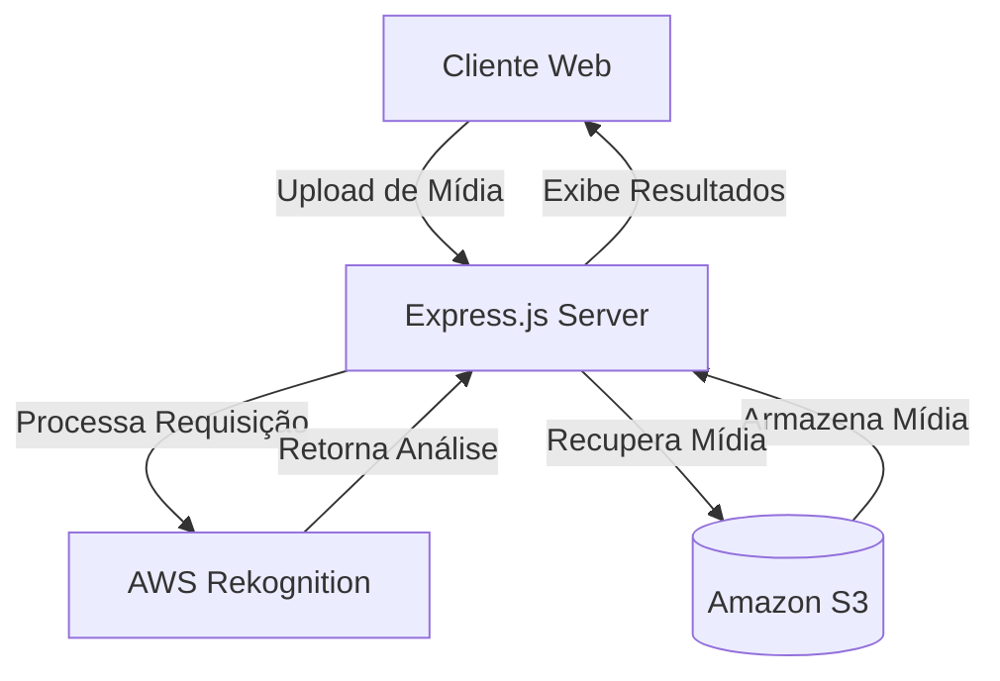

# AWS Rekognition Node.js

Este projeto é uma aplicação Node.js que demonstra o uso do AWS Rekognition para análise de imagens e vídeos. A aplicação foi desenvolvida usando TypeScript e Express.js, oferecendo uma interface web para upload e análise de mídia.

## 🏗️ Arquitetura



## 🚀 Funcionalidades

- Upload de imagens e vídeos
- Análise facial em imagens
- Detecção de objetos
- Reconhecimento de texto em imagens
- Análise de vídeos em tempo real
- Interface web amigável

## 🛠️ Tecnologias Utilizadas

- Node.js
- TypeScript
- Express.js
- AWS SDK
- EJS (Template Engine)
- Multer (Upload de arquivos)
- Bootstrap (UI)
- Moment.js (Formatação de datas)

## 📋 Pré-requisitos

- Node.js (v14 ou superior)
- Conta AWS com acesso ao Rekognition
- AWS CLI configurado
- Yarn ou NPM

## ⚙️ Configuração

1. Clone o repositório:
```bash
git clone https://github.com/marcosvrc/aws-rekognition-node.git
cd aws-rekognition-node
```

2. Instale as dependências:
```bash
yarn install
```

3. Configure as credenciais AWS:
```bash
aws configure
```

4. Configure as variáveis de ambiente:
```bash
cp .env.example .env
```
Edite o arquivo .env com suas configurações:
```
AWS_REGION=sua-regiao
AWS_ACCESS_KEY_ID=sua-access-key
AWS_SECRET_ACCESS_KEY=sua-secret-key
```

## 🚀 Executando o Projeto

### Desenvolvimento
```bash
yarn dev
```

### Produção
```bash
yarn build
yarn start
```

A aplicação estará disponível em `http://localhost:3000`

## 📁 Estrutura do Projeto

```
aws-rekognition-node/
├── src/
│   ├── config/         # Configurações do AWS e Express
│   ├── controllers/    # Controladores da aplicação
│   ├── routes/         # Rotas da aplicação
│   ├── services/       # Serviços de integração com AWS
│   ├── views/          # Templates EJS
│   └── index.ts        # Ponto de entrada da aplicação
├── public/            # Arquivos estáticos
├── dist/             # Código compilado
├── package.json
└── tsconfig.json
```

## 🔒 Segurança

- Todas as credenciais AWS devem ser armazenadas em variáveis de ambiente
- Implemente validação de tipos de arquivo permitidos
- Configure corretamente as permissões IAM
- Implemente rate limiting para as requisições
- Monitore o uso dos serviços AWS

## 📈 Monitoramento

- Use AWS CloudWatch para monitorar as chamadas ao Rekognition
- Configure alertas para custos e uso
- Implemente logs estruturados
- Monitore o desempenho da aplicação

## 💰 Custos

O AWS Rekognition cobra por uso. Consulte a [documentação de preços](https://aws.amazon.com/rekognition/pricing/) para mais detalhes.

## 🤝 Contribuindo

1. Faça um Fork do projeto
2. Crie sua Feature Branch (`git checkout -b feature/AmazingFeature`)
3. Commit suas mudanças (`git commit -m 'Add some AmazingFeature'`)
4. Push para a Branch (`git push origin feature/AmazingFeature`)
5. Abra um Pull Request

## 📝 Licença

Este projeto está sob a licença MIT. Veja o arquivo [LICENSE](LICENSE) para mais detalhes.

## 👤 Autor

Marcos Vinicius
- GitHub: [@marcosvrc](https://github.com/marcosvrc)

## 🙏 Agradecimentos

- AWS por fornecer o serviço Rekognition
- Comunidade Node.js
- Contribuidores do projeto